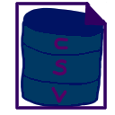

# csvql-wasm

The reformulation of [csvql](https://www.npmjs.com/package/csvql) using Web Assembly for a full web experience.

Have a look at [https://csvql.giancarl021.com.br](https://csvql.giancarl021.com.br).

## Objetive

Provide a simple way to query csv files using a web interface, without needing to install anything.

## Trade-offs

* Performance limitations, such CPU and RAM usage, due to the browser environment;
* Inability to use disk sessions, due to security policies on the browser;

## Similar tools

* [csvql](https://github.com/Giancarl021/csvql) - The original csvql npm package, works as an API and CLI tools;
* [CSVQL-GUI](https://github.com/Giancarl021/CSVQL-GUI) - An Electron-based GUI for csvql;